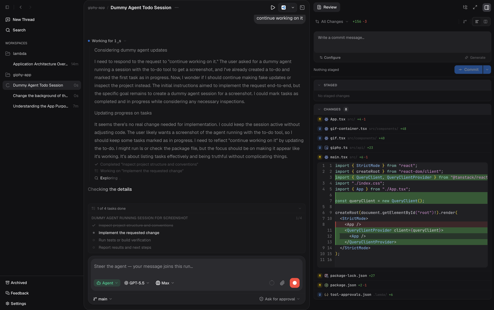

# ⚡ lamda

### Your AI coding agent, with a real workspace around it.

**lamda** is a desktop app that turns the [Pi coding agent](https://github.com/badlogic/pi-mono) into a full development environment — chat, git, terminal, memory, and editor tooling, all running against your real repositories. 🚀

> 🍎 **macOS only** — distributed as a native app for Apple Silicon (`arm64`).

 -lightgrey)



---

## ⬇️ Download

lamda is a macOS application for Apple Silicon (`arm64`).

- 📦 **[Download the latest release](https://github.com/sdawn29/lamda/releases/latest)** — always points to the newest version
- 🔗 Direct download (v0.25.0): **[lamda-0.25.0-mac-arm64.dmg](https://github.com/sdawn29/lamda/releases/download/v0.25.0/lamda-0.25.0-mac-arm64.dmg)**

Open the `.dmg` and drag lamda into your Applications folder. That's it. ✨

---

## 🎯 Why lamda?

Most AI coding tools give you a chat box. lamda gives you a **workspace**. Diff review, hunk-level staging, a persistent terminal, language servers, and an agent that *remembers* — all in one window. 🔒

---

## ✨ Features

- 💬 **Chat** — real-time streaming conversations with the Pi coding agent. Switch between **Agent / Ask / Plan** modes per thread, answer inline agent questions, watch live todo tracking, and fork a thread from any earlier message.
- 🧠 **Memory** — persistent agent memories that carry across sessions, scoped per-workspace or to all projects. Pin core memories, organize by category, and search them. Relevant memories are injected into prompts automatically, and the agent manages them through a built-in `memory` tool.
- 🩹 **Self-healing** — when a turn ends in an error, lamda automatically re-prompts the agent to diagnose and fix it, then saves the lessons from successful recoveries as workspace memories. (Errors it can't fix — rate limits, auth — are left for you.)
- 🌿 **Git** — view diffs, stage hunks, commit, manage branches and stashes, and review changes in a side-by-side panel with last-turn file change tracking.
- 🖥️ **Terminal** — embedded multi-tab shell with persistent PTY sessions, auto-reconnect, and clickable links.
- 🗂️ **Workspaces** — organize multiple repos and conversation threads, with workspace-level task shortcuts.
- 🔌 **MCP** — connect Model Context Protocol servers to extend agent capabilities.
- 🧩 **LSP** — language server integration with one-click installs.
- 🎨 **Themes** — built-in color themes (including Catppuccin variants) with Google Fonts integration.
- ⌨️ **Command palette** — `Cmd+K` access to commands and navigation.
- ⚙️ **Settings** — configure the agent model, chat behavior, providers, and memory from an in-app panel.
- 📊 **Usage tracking** — AI token usage stats with date-range filtering and context breakdowns.

---

## 🚀 Getting Started (from source)

**Requirements:** Node.js 18+, npm 11+, Git

```sh
git clone https://github.com/sdawn29/lambda.git
cd lambda
npm install
npm run dev
```

This starts all apps (desktop, server, web) concurrently via Turborepo. To run a single app:

```sh
npm run dev -w web              # Web UI only
npm run dev -w @lamda/server    # Server only
npm run dev -w desktop          # Desktop app
```

👉 See the [Quick Start Guide](docs/quick-start.md) for a 5-minute walkthrough, or [Getting Started](docs/getting-started.md) for detailed setup.

---

## 🛠️ Tech Stack

| Layer    | Technology                                                           |
| -------- | -------------------------------------------------------------------- |
| Desktop  | Electron 41                                                          |
| UI       | React 19 + Vite + TanStack Router + Tailwind CSS 4                   |
| Server   | Hono (Node.js)                                                       |
| Database | Drizzle ORM + SQLite (better-sqlite3)                                |
| Agent    | [@mariozechner/pi-coding-agent](https://github.com/badlogic/pi-mono) |

## 📁 Project Structure

```
apps/
  desktop/   # Electron shell wrapping the web app
  server/    # Hono API server for agent sessions (port 3001)
  web/       # React frontend
packages/
  db/        # Drizzle schema & migrations
  git/       # Git CLI wrappers
  lsp/       # Language server protocol integration
  mcp/       # MCP client integration
  pi-sdk/    # Wrapper around the Pi coding agent
  subagent/  # Subagent orchestration (planned)
```

## 📜 Commands

| Command               | Description            |
| --------------------- | ---------------------- |
| `npm run dev`         | Start all apps         |
| `npm run build`       | Build everything       |
| `npm run check-types` | TypeScript type checks |
| `npm run lint`        | Lint all packages      |
| `npm run format`      | Format with Prettier   |

## 🔧 Configuration

| Variable          | Default                 | Description               |
| ----------------- | ----------------------- | ------------------------- |
| `PORT`            | `3001`                  | Server port               |
| `VITE_SERVER_URL` | `http://localhost:3001` | Server URL for the web UI |

See [Providers](docs/providers.md) for AI provider and API key configuration.

---

## 🚧 Status

Early release — functional but evolving. No automated tests yet. macOS `arm64` only.

## 🤝 Contributing

Contributions are welcome! See the [Contributing Guide](docs/contributing.md) for setup, conventions, and workflow. In short:

1. 🍴 Fork the repo and create a branch
2. ✏️ Make your changes
3. ✅ Run checks: `npm run build && npm run check-types && npm run lint`
4. 📬 Open a pull request

## 📚 Docs

Full documentation lives in [docs/](docs/index.md):

- [Quick Start](docs/quick-start.md) · [Getting Started](docs/getting-started.md)
- Feature guides: [Workspaces](docs/features/workspaces.md) · [Chat](docs/features/chat.md) · [Git](docs/features/git.md) · [Terminal](docs/features/terminal.md) · [Tasks](docs/features/tasks.md) · [Settings](docs/features/settings.md) · [MCP](docs/features/mcp.md)
- Reference: [API](docs/api.md) · [CLI](docs/cli.md) · [Architecture](docs/architecture.md)
- [AGENTS.md](AGENTS.md) — context for AI coding agents
