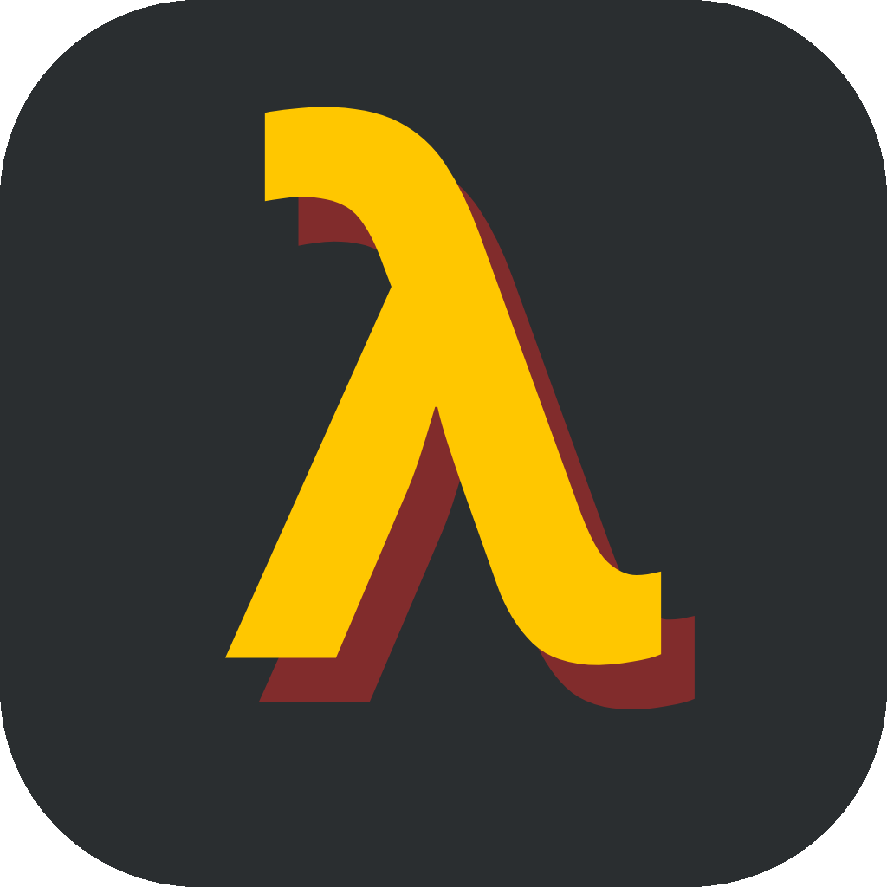
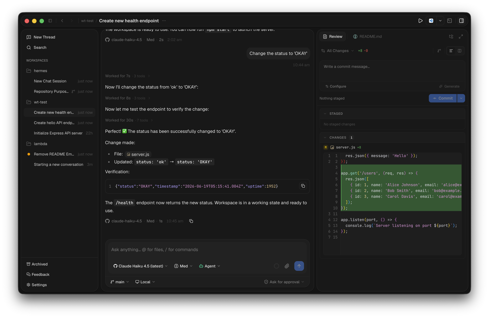

<p align="center">
  
</p>

<h1 align="center">lamda</h1>

<p align="center">
  <strong>Your AI coding agent, with a real workspace around it.</strong>
</p>

<p align="center">
  <a href="https://github.com/sdawn29/lamda/releases/latest"></a>
  
  
</p>

<p align="center">
  <a href="https://github.com/sdawn29/lamda/releases/latest"><strong>Download latest release</strong></a>
  ·
  <a href="docs/quick-start.md">Quick start</a>
  ·
  <a href="docs/index.md">Docs</a>
</p>

<p align="center">
  
</p>

**lamda** is a desktop app that turns the [Pi coding agent](https://github.com/badlogic/pi-mono) into a full development environment: chat, git, terminal, memory, and editor tooling, all running against your real repositories.

> **macOS only** — distributed as a native app for Apple Silicon (`arm64`).

---

## Download

lamda is a macOS application for Apple Silicon (`arm64`).

| Option | Link |
| --- | --- |
| Latest release | **[Download from GitHub Releases](https://github.com/sdawn29/lamda/releases/latest)** |
| Direct download | **[lamda-0.28.0-mac-arm64.dmg](https://github.com/sdawn29/lamda/releases/download/v0.28.0/lamda-0.28.0-mac-arm64.dmg)** |

Open the `.dmg` and drag lamda into your Applications folder.

---

## Why lamda?

Most AI coding tools give you a chat box. lamda gives you a **workspace**. Diff review, hunk-level staging, a persistent terminal, language servers, and an agent that _remembers_ — all in one window.

---

## Features

| Feature | What it does |
| --- | --- |
| **Chat** | Real-time streaming conversations with Agent, Ask, and Plan modes per thread. |
| **Memory** | Workspace-scoped and global memories with pinning, categories, search, and automatic prompt injection. |
| **Self-healing** | Automatically re-prompts the agent after recoverable turn errors and stores successful recovery lessons. |
| **Git** | Diff review, hunk-level staging, commits, branches, stashes, and side-by-side change review. |
| **Terminal** | Embedded multi-tab shell with persistent PTY sessions, reconnects, and clickable links. |
| **Workspaces** | Organize multiple repos, conversation threads, and workspace-level tasks. |
| **MCP** | Connect Model Context Protocol servers to extend agent capabilities. |
| **LSP** | Language server integration with one-click installs. |
| **Themes** | Built-in themes, Catppuccin variants, and Google Fonts integration. |
| **Settings** | Configure the agent model, chat behavior, providers, and memory from the app. |
| **Usage tracking** | Token usage stats with date-range filtering and context breakdowns. |

---

## Getting Started (from source)

**Requirements:** Node.js 18+, npm 11+, Git

```sh
git clone https://github.com/sdawn29/lambda.git
cd lambda
npm install
npm run dev
```

This starts all apps (desktop, server, web) concurrently via Turborepo. To run a single app:

```sh
npm run dev -w web              # Web UI only
npm run dev -w @lamda/server    # Server only
npm run dev -w desktop          # Desktop app
```

See the [Quick Start Guide](docs/quick-start.md) for a 5-minute walkthrough, or [Getting Started](docs/getting-started.md) for detailed setup.

---

## Tech Stack

| Layer | Technology |
| --- | --- |
| Desktop | Electron 41 |
| UI | React 19 + Vite + TanStack Router + Tailwind CSS 4 |
| Server | Hono (Node.js) |
| Database | Drizzle ORM + SQLite (better-sqlite3) |
| Agent | [@mariozechner/pi-coding-agent](https://github.com/badlogic/pi-mono) |

## Project Structure

```text
apps/
  desktop/   # Electron shell wrapping the web app
  server/    # Hono API server for agent sessions (port 3001)
  web/       # React frontend
packages/
  db/        # Drizzle schema and migrations
  git/       # Git CLI wrappers
  lsp/       # Language server protocol integration
  mcp/       # MCP client integration
  pi-sdk/    # Wrapper around the Pi coding agent
  subagent/  # Subagent orchestration (planned)
```

## Commands

| Command | Description |
| --- | --- |
| `npm run dev` | Start all apps |
| `npm run build` | Build everything |
| `npm run check-types` | TypeScript type checks |
| `npm run lint` | Lint all packages |
| `npm run format` | Format with Prettier |

## Configuration

| Variable | Default | Description |
| --- | --- | --- |
| `PORT` | `3001` | Server port |
| `VITE_SERVER_URL` | `http://localhost:3001` | Server URL for the web UI |

See [Providers](docs/providers.md) for AI provider and API key configuration.

---

## Status

Early release — functional but evolving. No automated tests yet. macOS `arm64` only.

## Contributing

Contributions are welcome. See the [Contributing Guide](docs/contributing.md) for setup, conventions, and workflow. In short:

1. Fork the repo and create a branch
2. Make your changes
3. Run checks: `npm run build && npm run check-types && npm run lint`
4. Open a pull request

## Docs

Full documentation lives in [docs/](docs/index.md):

- [Quick Start](docs/quick-start.md) · [Getting Started](docs/getting-started.md)
- Feature guides: [Workspaces](docs/features/workspaces.md) · [Chat](docs/features/chat.md) · [Git](docs/features/git.md) · [Terminal](docs/features/terminal.md) · [Tasks](docs/features/tasks.md) · [Settings](docs/features/settings.md) · [MCP](docs/features/mcp.md)
- Reference: [API](docs/api.md) · [CLI](docs/cli.md) · [Architecture](docs/architecture.md)
- [AGENTS.md](AGENTS.md) — context for AI coding agents
