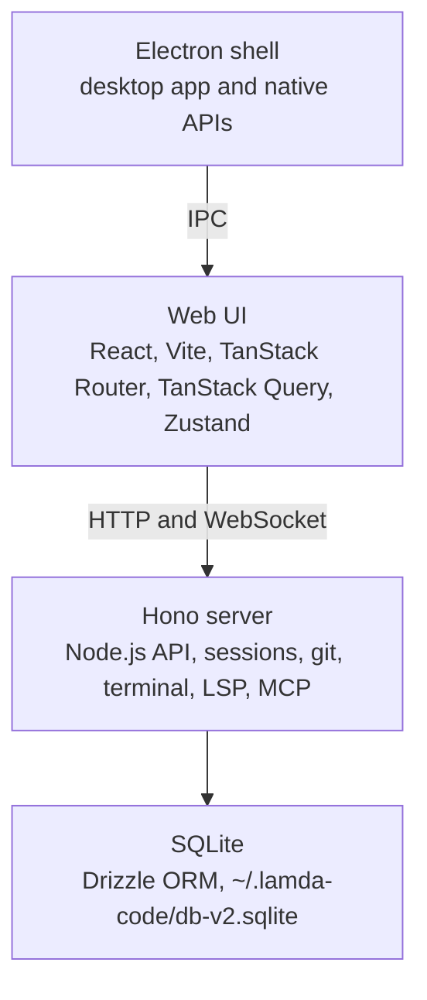
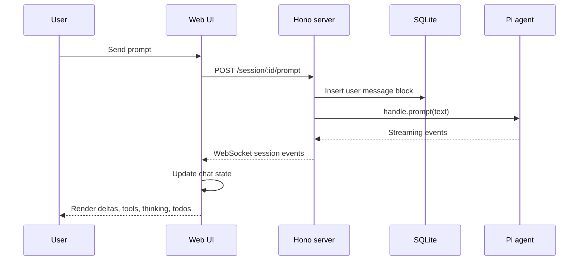
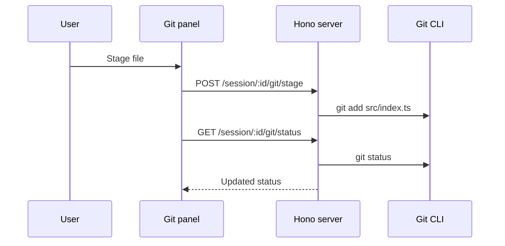
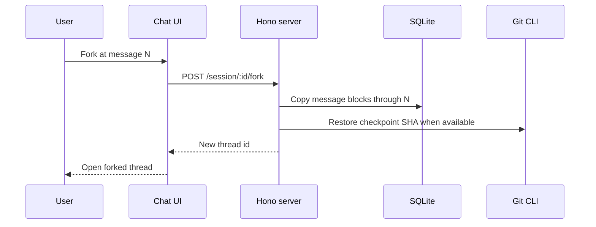

# Architecture

## Overview

`lamda` is a monorepo with three main application layers.



## Application Layers

### Desktop (`apps/desktop/`)

Electron shell that:

- Spawns the Hono server as a child process
- Exposes native APIs (folder selection, file opening, updates)
- Handles IPC communication with the renderer
- Manages app lifecycle and window management

**Key files:**

- `src/main.ts` — Main process entry
- `src/preload.ts` — Preload script for IPC bridge

### Web (`apps/web/`)

React 19 + Vite application with feature modules:

| Module          | Path                            | Purpose                                                        |
| --------------- | ------------------------------- | -------------------------------------------------------------- |
| Chat            | `src/features/chat/`            | Messaging, streaming, tool display, thread modes               |
| Git             | `src/features/git/`             | Diff view, hunk staging, commits, branches                     |
| Terminal        | `src/features/terminal/`        | xterm.js with WebSocket PTY                                    |
| Settings        | `src/features/settings/`        | Provider config, API keys                                      |
| Workspace       | `src/features/workspace/`       | Workspace/thread management                                    |
| Main Tabs       | `src/features/main-tabs/`       | Tab bar for threads and open files                             |
| Tasks           | `src/features/tasks/`           | Workspace custom shell command shortcuts                       |
| LSP             | `src/features/lsp/`             | Language server diagnostics in the file viewer                 |
| Command Palette | `src/features/command-palette/` | Keyboard-driven command and file search                        |
| File Tree       | `src/features/file-tree/`       | Workspace file browser                                         |
| MCP             | `src/features/mcp/`             | MCP server management UI                                       |
| Themes          | `src/features/themes/`          | Theming engine: built-in/custom themes, fonts, syntax palettes |
| Onboarding      | `src/features/onboarding/`      | First-run onboarding flow                                      |
| Electron        | `src/features/electron/`        | Desktop IPC wrapper                                            |

**Shared components:**

- `src/shared/ui/` — shadcn/ui component library
- `src/shared/lib/` — Utilities and helpers

### Server (`apps/server/`)

Hono API server that:

- Manages Pi agent sessions
- Streams events via WebSocket
- Handles git operations via CLI wrappers
- Provides WebSocket terminal service
- Bridges Language Server Protocol connections
- Persists data to SQLite

**Route modules:**

- `routes/sessions.ts` — Session lifecycle, prompts, streaming events
- `routes/threads.ts` — Thread CRUD, archive, pin, fork
- `routes/workspaces.ts` — Workspace CRUD
- `routes/git.ts` — Git operations
- `routes/lsp.ts` — LSP WebSocket bridge
- `routes/mcp.ts` — MCP server management
- `routes/tasks.ts` — Workspace task CRUD
- `routes/file.ts` — File read endpoint (range support, streaming)
- `routes/auth.ts` — API key management
- `routes/settings.ts` — Settings key/value store
- `routes/terminal.ts` — Terminal WebSocket endpoint
- `routes/usage.ts` — AI token/cost usage stats
- `routes/local-models.ts` — Local model provider CRUD
- `routes/health.ts` — Health check

**Services:**

- `services/session-service.ts` — Session management
- `services/terminal-service.ts` — PTY management (persistent sessions with reattachment)
- `services/language-service.ts` — LSP client lifecycle
- `services/lsp-installer.ts` — Language server installation
- `services/auth-service.ts` — API key management
- `services/mcp-service.ts` — MCP server connection lifecycle
- `services/models-config-service.ts` — Local model provider configuration
- `services/question-registry.ts` — Pending agent questions (question tool)
- `services/file-tree-service.ts` — Lazy file tree with directory watchers
- `services/workspace-indexer.ts` — Workspace file indexing for search

## Packages

### `@lamda/db` (`packages/db/`)

Drizzle ORM + SQLite persistence layer (file: `~/.lamda-code/db-v2.sqlite`):

| Table              | Purpose                                                       |
| ------------------ | ------------------------------------------------------------- |
| `workspaces`       | Repository metadata, path, pinned state, env vars             |
| `threads`          | Conversation threads (mode, forked_from_id, pinned, archived) |
| `message_blocks`   | Messages, thinking, tool calls, abort/compaction markers      |
| `settings`         | User preferences (key/value store)                            |
| `workspace_files`  | Indexed file tree per workspace (for search)                  |
| `workspace_tasks`  | User-defined shell command shortcuts per workspace            |
| `mcp_servers`      | MCP server configurations (application-wide)                  |
| `agent_turns`      | Records of each agent turn with git checkpoint SHA            |
| `agent_turn_files` | Files touched in each turn (for revert-to-turn)               |
| `ai_usage`         | Per-turn token and cost records for usage stats               |

### `@lamda/git` (`packages/git/`)

Git CLI wrapper functions:

- Branch operations (`getCurrentBranch`, `checkoutBranch`, `createBranch`)
- Diff operations (`gitFileDiff`, `gitDiffStat`, `gitStagedDiff`)
- Staging operations (`gitStage`, `gitUnstage`, `gitStageAll`, hunk-level staging)
- Commit operations (`gitCommit`, `gitPush`)
- Stash operations (`gitStash`, `gitStashPop`)
- Revert operations (`gitRevertFile`, `gitRestoreFileFromRef`)

### `@lamda/pi-sdk` (`packages/pi-sdk/`)

Wrapper around `@mariozechner/pi-coding-agent`:

- Session creation and management
- Prompt handling with mode support (`ask`, `plan`, `agent`)
- Event streaming
- Model selection
- Thinking level control (`getSupportedThinkingLevels`)
- Session history read-back for thread restoration

### `@lamda/lsp` (`packages/lsp/`)

Language Server Protocol integration:

- Language server registry (TypeScript, Python, etc.)
- Document open/close lifecycle
- Diagnostics push (errors, warnings) for open files
- Path utilities (`uriToPath`)

### `@lamda/mcp` (`packages/mcp/`)

Model Context Protocol client management:

- MCP server connection lifecycle
- Tool registration and invocation
- Cleanup on server stop

### `@lamda/subagent` (`packages/subagent/`)

Utilities for running subordinate agent tasks within a Pi session.

## Data Flow

### Chat Message Flow



### Git Operations



### Thread Forking



## State Management

### Server (In-Memory)

```typescript
// store.ts
const store = new Map<sessionId, ManagedSessionHandle>();
```

Sessions are ephemeral — stored in memory and lost on server restart.

### Web (TanStack Query + Zustand)

- **Server state**: TanStack Query for API data (messages, git status, etc.)
- **UI state**: Zustand stores (theme, sidebar, terminal tabs, main tabs, tasks)
- **Persistence**: durable UI state and preferences are stored in the server's SQLite `settings` table (key/value store), not localStorage

## Communication Protocols

### Authentication

The server API and WebSocket upgrades are protected by token-based authentication. The desktop shell passes the token to the web UI at startup; WebSocket upgrade requests are also origin-checked (`file://` is allowed for the packaged desktop app).

### WebSocket (Session Streaming)

Used for real-time streaming from server to client:

- Session events (message deltas, tool calls, thinking, context usage)
- Thread status updates
- Session command list

Each session has a dedicated WebSocket channel. The client reconnects automatically on disconnect.

### WebSocket (Terminal)

Used for PTY terminal communication:

- Client → Server: terminal input, resize events
- Server → Client: PTY output, exit codes

Protocol: JSON messages with `type` field

### WebSocket (LSP)

Used for Language Server Protocol bridging:

- Client → Server: `open`, `close`, `request` messages
- Server → Client: `response`, `diagnostics` messages

### IPC (Desktop only)

Desktop main process ↔ renderer:

- `electronAPI.selectFolder()` — Native folder picker
- `electronAPI.getServerPort()` — Server port discovery
- `electronAPI.openPath()` — Open files externally

## Thread Modes

Each thread operates in one of three modes, stored in the `threads.mode` column:

| Mode    | Description                                                 |
| ------- | ----------------------------------------------------------- |
| `agent` | Default — full coding agent with file read/write/edit tools |
| `ask`   | Question-answering mode — read-only tools, no file edits    |
| `plan`  | Planning mode — agent proposes a plan before executing      |

The mode is passed to the Pi agent via `getModePreamble()` at session start.

## Build Output

| Package   | Output            | Format            |
| --------- | ----------------- | ----------------- |
| `web`     | `dist/`           | ESM + Vite chunks |
| `server`  | `dist/server.cjs` | CommonJS bundle   |
| `desktop` | `release/`        | `.dmg`, `.zip`    |

## Key Conventions

- **TypeScript strict mode** everywhere
- **ESM** in web and packages (`"type": "module"`)
- **CJS** in server (build target via esbuild)
- **npm workspaces** for dependency management
- **Turborepo** for build orchestration
